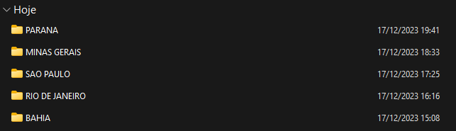
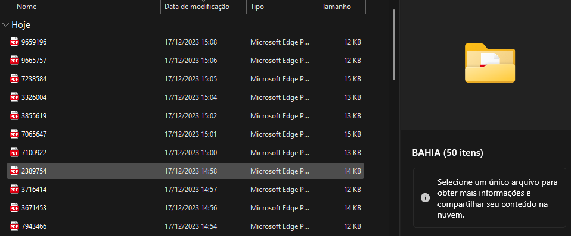

# Teste técnico Prime Robot - Desenvolvedor Pl

# Desafio 

O desafio principal é automatizar o processo de extração do dados do site CNES Datasus

# Requerimentos

- Ler uma lista de localidades (LOCALIDADES.CSV)
- Buscar cada localidade no site informado
- Extrair os dados dos estabelecimentos de saúde de cada localidade buscada. 
- Com os dados, a automação deverá buscar cada registro usando o CNES e acessar individualmente no ícone de impressão.
- Marcar a ficha completa para buscar todas as informações.
- Fazer o download da ficha no formato PDF, salvar este arquivo em uma pasta com o `NUMERO-CNES.pdf` onde é o `CNES` do estabelecimento atual.

# Como rodar?

Primeiro, é necessário a criação de uma virtual env 

- Comando para a criação do virtual env: `python -m venv venv`
- Ativar o venv com o comando:  `venv\Scripts\activate` no Windows.
- Depois de ativada, basta instalar as dependências do projeto que já estão inclusas no arquivo `requirements.txt`, com o comando: `pip install -r requirements.txt`
- Com as dependências prontas, rodamos o arquivo robot com o comando: `robot ./tests`. Caso esse comando não funcionar, certifique-se de que instalou o RobotFramework.

# Resultados 

Primeiro, fiz passo-a-passo cada requisição, quebrando em pequenos problemas, o programa faz os seguintes passos: 

- Abertura do navegador
- Leitura do arquivo CSV
- Foi necessário o mapeamento da UF para os estados para extenso exemplo: BA - para BAHIA e remoção dos acentos (criação de um script Python) para realizar a pesquisa corretamente. 
- Faz a pesquisa dos estabelecimentos
- Percorre a lista de cada estabelecimento pesquisado, realizando a pesquisa nas 5 páginas, resultado em 50 estabelecimentos pesquisados por estado/município.

Consegui chegar no resultado proposto pelo desafio, conforme as imagens abaixo:

Nesse exemplo, após realizado a primeira busca do CNES de um estabelecimento, na minha pasta de downloads crio uma pasta referente ao estado que pesquisei e salvo os estabelecimentos referentes.

Se observarmos no print acima, foram criados 50 arquivos, cada um com seu nome de CNES subsequente. 

# Decisões tomadas

- Optei por cada pesquisa individual ser aberta em uma nova guia para ser efetuada a operação de download da ficha do estabelecimento. Assim não seria necessário fazer a busca da localidade novamente. 

- Utilizei a biblioteca rpaframework, justamente por conter todas as libs necessárias para a automação com o Robot. 

- Apesar de chegar ao resultado, imagino que há muito para ser trabalhado para se chegar no melhor resultado. 

- Também, foi utilizado muito a questão do Sleep, justamente para o site ter o tempo hábil de carregamento dos elementos DOM e não ter nenhum problema ao obter o xpath ou executar alguma ação de clique ou cópia de informações.

- Meu conhecimento de JavaScript/DevTools me ajudou a obter os elementos HTML rapidamente, sem muito esforço.